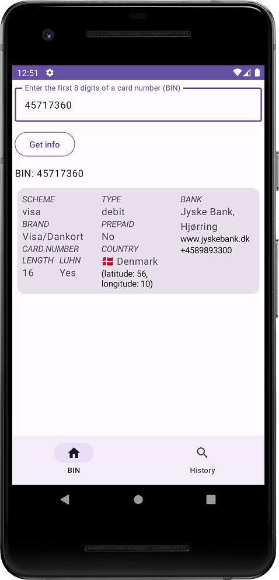
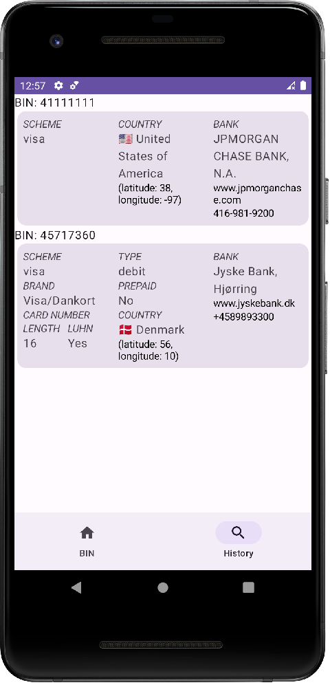

# CFT test task

Реализовать Android-приложение со следующими функциями:

1. Пользователь вводит BIN банковской карты и видит всю доступную информацию о нём, загруженную
   с [https://binlist.net/](https://binlist.net/)
2. История предыдущих запросов выводится списком
3. История предыдущих запросов не теряется при перезапуске приложения
4. Нажатие на URL банка, телефон банка, координаты страны отправляет пользователя в приложение,
   которое может обработать эти данные (браузер, звонилка, карты)

Empty history search

Error input

Ok

Ok

No matching cards

No internet
